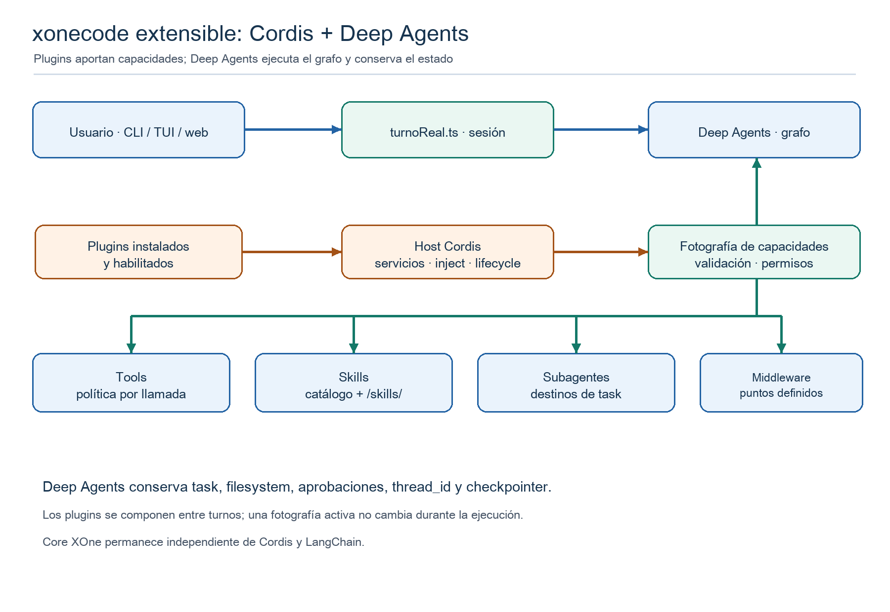

# Evolución de xonecode: harness extensible con Cordis y Deep Agents

**Propuesta técnica para el equipo · 17 de septiembre de 2026**  
**Estado:** diseño, sin implementación ni prueba de compatibilidad entre paquetes.

## 1. Objetivo y corrección del enfoque

El objetivo no es importar algunos plugins de DeepSeek Harness. Es convertir **xonecode en un harness abierto a capacidades nuevas**: subagentes, skills, herramientas, middleware y servicios aportados por extensiones, sin perder su comportamiento XOne ni el agente de Deep Agents que ya funciona. La decisión anterior de no adoptar el *andamiaje completo* de DeepSeek Harness sigue teniendo sentido para su Agent Loop y su consola, pero no resuelve por sí sola la pregunta de cómo abrir xonecode a extensiones. Cordis puede ser la pieza de composición para eso.

**Recomendación:** Deep Agents sigue ejecutando el grafo, `task`, filesystem, aprobaciones y checkpoint. Cordis vive alrededor de la construcción del grafo como host de plugins y servicios. Cada plugin declara lo que aporta; xonecode valida, filtra por perfil y entrega una **fotografía de capacidades** a `createDeepAgent`. Un plugin no cambia a mitad de un turno el grafo que ya se está ejecutando.



## 2. Punto de partida real

| Capacidad | Hoy en xonecode | Mejora con Cordis |
|---|---|---|
| Subagentes | Ficheros globales y por proyecto bajo `.xonecode/agentes`; modelos locales o motores externos; entran en `task`. | Otros paquetes pueden **aportar definiciones o ejecutores** al mismo catálogo, con origen, disponibilidad y permisos explícitos. |
| Skills | `SkillsEnDisco` lee las incluidas en el paquete; `/skills/` apunta a esa raíz; cada especialista declara sus nombres. | Catálogo compuesto: incluidas + instaladas + declarativas de proyecto. Cada skill se monta en una ruta virtual estable y se asigna por perfil. |
| Herramientas | Tools propias, middleware de filesystem y políticas configuradas en `xoneAgent.ts`. | Plugins registran tools tipadas con efectos declarados; xonecode las envuelve con su política y las asigna sólo a perfiles autorizados. |
| Middleware | Lista construida manualmente por orquestador y especialistas. | Puntos de extensión concretos, con orden y reglas de conflicto, sin permitir reemplazar silenciosamente guardas críticas. |
| Servicios | Dependencias conectadas principalmente por imports y opciones del constructor. | Cordis resuelve servicios declarados mediante `inject` y retira registros mediante efectos al desmontar. |

Estas conclusiones salen de [xoneAgent.ts](/Users/projects/xonecode/src/agent/grafo/xoneAgent.ts), [skills.ts](/Users/projects/xonecode/src/agent/grafo/skills.ts), [proyecto.ts](/Users/projects/xonecode/src/agent/grafo/proyecto.ts), [agentesEnDisco.ts](/Users/projects/xonecode/src/agent/subagentes/agentesEnDisco.ts) y [turnoReal.ts](/Users/projects/xonecode/src/agent/turno/turnoReal.ts). Las reglas de negocio siguen en `core/`; su prueba de imports impide acoplarlo a Deep Agents, y Cordis debe respetar esa frontera.

## 3. Qué responsabilidad tiene cada capa

1. **Core de xonecode:** conceptos estables del dominio (`Agente`, `SkillsPort`, políticas de proyecto, eventos). No importa Cordis ni LangChain. Cuando una extensión necesita una capacidad del dominio, se expone un puerto pequeño.
2. **Host Cordis (`agent/plugins`):** carga plugins instalados y habilitados, resuelve dependencias entre servicios, conserva su ciclo de vida y publica un catálogo de aportaciones. Cordis no ejecuta el razonamiento del modelo.
3. **Ensamblador de capacidades:** combina aportaciones de varias fuentes, valida nombres y efectos, decide qué perfil recibe cada capacidad y produce una fotografía inmutable versionada. Aquí se resuelven colisiones. Ningún plugin modifica directamente el objeto de opciones de `createDeepAgent`.
4. **Adaptadores:** convierten cada aportación validada al tipo que necesita Deep Agents: tool, definición de subagente, ruta de skill, middleware o fragmento de prompt. También ofrecen la misma interfaz a un futuro plugin remoto, sin prometer que el código remoto se ejecute dentro del proceso.
5. **Deep Agents y LangGraph:** poseen el loop, la herramienta `task`, el estado de conversación y las interrupciones. Sus tools y subagentes se fijan al construir el grafo.

Cordis aporta **composición y ciclo de vida**. Una skill sigue siendo contenido `SKILL.md`, un subagente sigue siendo un destino de `task` y una tool sigue siendo una llamada de LangChain. No conviene llamar “plugin” a cada uno de esos objetos: el plugin es el paquete que puede aportarlos.

## 4. Contrato de una extensión

El SDK de xonecode debe ofrecer un contrato propio, pequeño y versionado. El código siguiente expresa la forma deseada; no es una afirmación de que Cordis o Deep Agents ya exporten estos tipos.

```ts
interface XoneExtension {
  id: string;                         // p. ej. "acme.xone-audit"
  apiVersion: 1;
  activate(ctx: ExtensionContext): void | Promise<void>;
}

interface ExtensionContext {
  services: {
    registerTool(tool: ToolContribution): () => void;
    registerSkill(skill: SkillContribution): () => void;
    registerSubagent(agent: SubagentContribution): () => void;
    registerMiddleware(item: MiddlewareContribution): () => void;
  };
  project: Readonly<{ root: string; id: string }>;
  signal: AbortSignal;
}

interface ContributionBase {
  id: string;                         // nombre completo, con namespace del plugin
  profiles: readonly string[];       // "orquestador" o especialistas autorizados
  requiredCapabilities: readonly Capability[];
}
```

Cada `register...` debe crear un efecto reversible de Cordis. El ensamblador no acepta nombres de tool reservados (`task`, `read_file`, `write_file`, etc.) ni dos aportaciones con el mismo id. El plugin declara capacidades como `read:project`, `write:project`, `network` o `process`; **declararlas no concede permiso**. La política de xonecode calcula el permiso efectivo por sesión, proyecto, perfil y llamada. Una tool que lee un fichero comprueba la ruta real dentro de su cuerpo, incluso cuando su schema parece inocuo.

Hay que distinguir las fuentes: **incluida**, **instalada y confiable**, **configuración de usuario/proyecto** y **remota**. Un `SKILL.md` o un `.md` de subagente del proyecto son datos; encontrar un `index.js` en el proyecto no lo ejecuta. Los plugins TypeScript instalados se habilitan explícitamente. Para código no confiable se necesitaría aislamiento en otro proceso y un protocolo de capacidades; Cordis por sí solo no es un sandbox.

## 5. Cómo engranan subagentes, skills y tools

### Subagentes

`cargarAgentes(raiz)` ya une definiciones globales y de proyecto. El ensamblador añade contribuciones de plugins **antes** de llamar a `construirAgente`. Una extensión puede aportar una definición de especialista basada en modelo o un ejecutor externo adaptado a `CompiledSubAgent`; ambos aparecen bajo el mismo `task`. La descripción, modelo, `soloLectura`, skills y herramientas deben validarse juntos. Si el ejecutor no está disponible, el destino no se publica al orquestador. Los nombres incorporados, los del usuario y los del plugin tienen reglas de precedencia explícitas: ninguna sustitución silenciosa; una sustitución solicitada debe quedar visible en configuración.

### Skills

Hoy `SkillsEnDisco` sólo conoce la raíz distribuida con xonecode y `backendConSkills` monta esa carpeta en `/skills/`. Para abrirla, se crea un **catálogo compuesto** que proporciona metadatos y contenido, y un montaje de sólo lectura que hace visibles las skills instaladas bajo rutas virtuales estables. Las skills de plugins usan nombres con namespace, por ejemplo `acme.xone-audit/revision`, para evitar colisiones. La asignación sigue siendo por especialista; las skills no se heredan automáticamente del orquestador. Al cargar una extensión, el catálogo, el prompt (`promptDeAgente`) y las rutas dadas a `SkillsMiddleware` deben derivarse de la **misma fotografía**, para que el agente no anuncie una skill ausente.

### Herramientas y middleware

Las tools de un plugin se convierten a `StructuredTool` y se añaden sólo al especialista permitido. El envoltorio aplica autorización, `AbortSignal`, límite de tiempo, saneado de salida y registro de eventos antes y después de ejecutar. `permisosDe` protege las tools de filesystem de Deep Agents, pero no protege automáticamente una tool nueva; por eso la política del envoltorio es obligatoria. El middleware de plugin se ubica en *puntos de extensión* definidos y no puede reemplazar `createFilesystemMiddleware`, `middlewareTextoDeTool` o el seguimiento de uso por compartir nombre. Para cambios de prompt, secciones con prioridad y longitud máxima resultan más auditables que permitir reemplazar el prompt completo.

## 6. Flujo desde el mensaje del usuario

1. Al abrir sesión, `turnoReal.ts` carga configuración y solicita al host Cordis las extensiones habilitadas. El host resuelve sus servicios `inject` y registra efectos.
2. El ensamblador fusiona las capacidades incluidas, las definidas por el usuario y las de plugins. Valida compatibilidad, permisos, duplicados y disponibilidad. Devuelve una fotografía `capabilitySetVersion`.
3. `xoneAgent.ts` usa esa fotografía para construir orquestador y especialistas. `task` conoce los subagentes visibles; cada especialista recibe sus skills, tools y middleware. El mismo `thread_id` y checkpointer conservan el historial.
4. Llega el mensaje. Deep Agents decide llamar a `task`; el especialista carga una skill si la necesita y puede llamar a una tool. El envoltorio comprueba la política **en esa llamada**, ejecuta el callback del plugin y convierte la salida a un `ToolMessage` compatible con Ollama.
5. `puente.ts` emite a CLI, TUI o web los eventos saneados. El plugin sólo puede publicar los eventos que el SDK le permite; no recibe el transcript completo por defecto.
6. Un cambio de modelo o de catálogo solicita reconstrucción **entre turnos**. El grafo activo y las aprobaciones pendientes conservan su fotografía hasta terminar o cancelarse; después se desmontan efectos antiguos y se crea el grafo nuevo. Una extensión que desaparece no se ejecuta desde una fotografía nueva.

## 7. Política de apertura

La apertura debe ser real y gradual. Primera prioridad: **plugins locales TypeScript confiables** y skills declarativas instaladas. Segunda: subagentes aportados por plugins y paquetes de skills compartibles. Tercera: adaptadores MCP o servicios remotos como fuentes de tools; entran por el mismo registro y la misma política. Cuarta: ecosistema de paquetes de terceros con aislamiento, versión de API, actualización y auditoría. Los plugins de DeepSeek Harness son una posible fuente a adaptar, no el centro del diseño: muchos dependen de `ctx.tools`, `ctx.systemPrompt`, `ctx.agents` y servicios propios, y no basta con importarlos.

El registro debe exponer a las tres interfaces **qué plugin está activo, origen, versión, perfiles que alcanza y permisos concedidos**. La activación de una versión nueva se decide antes de la sesión; una recarga durante el turno se difiere. Un fallo de plugin se atribuye al plugin y no tumba los otros registros; un fallo de política nunca se convierte en permiso implícito.

## 8. Plan de trabajo propuesto

| Fase | Entrega comprobable |
|---|---|
| 0. Prueba de compatibilidad | `@deepseek-ai/cordis` en una rama aislada, plugin mínimo, `npm run typecheck` y ejecución de una tool con la versión fijada de Deep Agents. |
| 1. Host y SDK | Context por sesión, servicios Cordis mínimos, `register...` reversible, manifiesto, diagnóstico de montaje y cierre esperado. |
| 2. Tools | Tool de lectura de ejemplo en un especialista, política por llamada, eventos saneados, cancelación y tests de rechazo de rutas sensibles. |
| 3. Skills | `SkillsPort` compuesto y montaje virtual seguro; skill instalada que un especialista anuncia y carga bajo demanda. |
| 4. Subagentes | Fusión de agentes de disco y de plugins; destino de `task` disponible sólo cuando su ejecutor y capacidades están presentes. |
| 5. Middleware y apertura | Orden documentado, secciones de prompt, API versionada y primer adaptador externo seleccionado. |

El piloto debería ser una extensión de **auditoría XOne de sólo lectura** que aporte una tool, una skill y un especialista. Así se verifica de extremo a extremo la utilidad del SDK sin empezar por efectos de escritura o red.

## 9. Criterios de aceptación y decisiones pendientes

- Con plugins deshabilitados, los flujos y tests existentes mantienen su comportamiento.
- El mismo plugin se monta y desmonta varias veces sin duplicar tools, skills ni subagentes.
- La tool sólo aparece en el perfil autorizado; el orquestador no recibe su schema si no está autorizado.
- Una skill aportada es visible en el catálogo, en el prompt y en `/skills/` bajo la misma versión de fotografía; su fichero no puede escribirse desde el agente.
- Un subagente aportado aparece en `task` sólo si su motor está disponible y sus permisos son efectivos.
- Una llamada a tool no elude rutas denegadas, aprobación ni cancelación. Las tres interfaces muestran origen y estado sin publicar argumentos crudos.
- Cambio de modelo y recarga preservan `thread_id` y checkpoint, no alteran llamadas en curso y cierran el host viejo al quedar libre.
- Queda por fijar antes de implementar: formato final del manifiesto, precedencia exacta frente a definiciones del usuario, política de firma/confianza de plugins y alcance de la API pública v1. La prueba de fase 0 decide si Cordis encaja con las dependencias actuales.

## 10. Referencias

La propuesta se apoya en el código local de xonecode y en el [primer de Cordis](/Users/projects/harnees/deepseek-harness/docs/cordis-primer.md), que describe `inject`, servicios y efectos reversibles. Para las opciones TypeScript del grafo se contrastaron las guías oficiales de [personalización de Deep Agents](https://docs.langchain.com/oss/javascript/deepagents/customization) y [skills](https://docs.langchain.com/oss/javascript/deepagents/skills). Las APIs exactas se deben comprobar contra las versiones instaladas en la fase 0.
