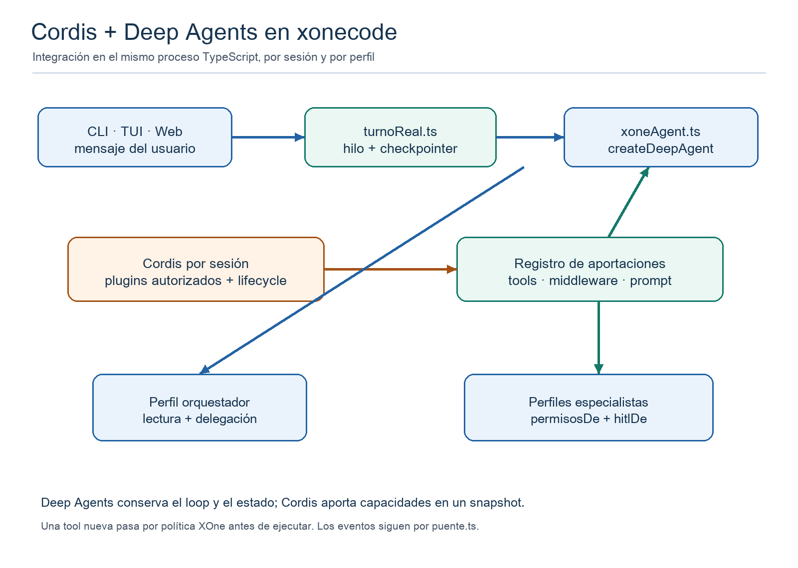

# Integración de Cordis con Deep Agents en xonecode

**Documento para implementación · 17 de septiembre de 2026**

## 1. Decisión propuesta

Incorporar Cordis como **registro optativo de extensiones dentro del proceso TypeScript de xonecode**. Deep Agents mantiene el control del razonamiento, los subagentes y el hilo de LangGraph. Cordis monta plugins y entrega al constructor del agente una fotografía de herramientas, middleware e instrucciones aprobadas para cada perfil. La primera versión admite un plugin propio de xonecode con una herramienta de solo lectura. La reutilización de plugins de DeepSeek Harness se evalúa después, uno a uno.

No se sustituye el Agent Loop de Deep Agents por el de DeepSeek Harness. Tampoco se duplica el estado de conversación: el checkpointer de xonecode sigue siendo la fuente de continuidad y los eventos de xonecode siguen alimentando CLI, TUI y web. Esta propuesta revisa de forma acotada la decisión actual de xonecode de no adoptar el andamiaje Cordis completo; esa decisión consta en [FORTALEZAS-DSH.md](/Users/projects/xonecode/docs/FORTALEZAS-DSH.md) y en el [diseño de la consola web](/Users/projects/xonecode/docs/superpowers/specs/2026-09-04-consola-web-design.md).



## 2. Hechos del código que condicionan el diseño

- xonecode usa TypeScript, deepagents 1.13.2, LangChain y LangGraph. [package.json](/Users/projects/xonecode/package.json).
- [xoneAgent.ts](/Users/projects/xonecode/src/agent/grafo/xoneAgent.ts) construye un orquestador y especialistas. Cada especialista recibe sus propias tools, middleware, permisos y configuración de aprobación. El orquestador conserva acceso de lectura y delega el trabajo.
- [turnoReal.ts](/Users/projects/xonecode/src/agent/turno/turnoReal.ts) construye el agente una vez por sesión y conserva hilo, checkpointer y tracker. El comando de cambio de modelo reconstruye el grafo con el mismo hilo y checkpointer.
- [perfiles.ts](/Users/projects/xonecode/src/agent/grafo/perfiles.ts) define las denegaciones de rutas y el HITL de write_file/edit_file. Esas reglas cubren las tools de fichero de Deep Agents; una tool nueva necesita autorización propia.
- [core/imports.test.ts](/Users/projects/xonecode/src/core/imports.test.ts) impide que core importe LangChain o deepagents. Cordis debe permanecer también fuera de core.
- La salida de herramientas enviada a Ollama pasa por [middlewareTextoDeTool](/Users/projects/xonecode/src/agent/turno/textoDeTool.ts); las tools de plugins deben conservar ese camino.
- DeepSeek Harness expone herramientas por [ctx.tools.schemas y ctx.tools.execute](/Users/projects/harnees/deepseek-harness/packages/core/tools/src/index.ts). Su [bundle base](/Users/projects/harnees/deepseek-harness/packages/bundle/base/cordis.patch.yml) monta muchos servicios interdependientes, incluido su propio Agent Loop.

## 3. Alcance funcional

**Versión 1:** carga optativa de plugins confiables instalados en el runtime; catálogo de herramientas por perfil; tool calls dentro del mismo proceso; desmontaje limpio; resultado visible para Deep Agents; pruebas sin red ni credenciales. No se permite que un plugin de proyecto ejecute código por el solo hecho de estar en el repositorio.

**Versión 2:** secciones de prompt y middleware registrados por plugins, con orden explícito y límites de conflicto. Recarga de catálogo sólo entre turnos; una ejecución activa usa una fotografía inmutable de capacidades.

**Versión 3:** adaptadores seleccionados para plugins de DeepSeek Harness. Cada plugin exige una ficha de dependencias, política, datos que escribe y prueba de compatibilidad. No se anuncia compatibilidad general con todos sus paquetes.

## 4. Módulos y responsabilidades

1. **Host Cordis** en src/agent/plugins/host.ts: crea y posee un Context por sesión, monta sólo plugins autorizados y devuelve un método de cierre esperado. El host no llama al modelo.
2. **Registro de aportaciones** en src/agent/plugins/registro.ts: recibe entradas con id estable, perfiles destino, herramientas, middleware e instrucciones. Comprueba nombres duplicados, orden y capacidad declarada; cada alta devuelve un disposer.
3. **Adaptador a Deep Agents** en src/agent/plugins/adaptador.ts: proyecta cada fotografía a las opciones tools y middleware de createDeepAgent. Guarda la identidad del perfil y del proyecto fuera de los argumentos que ve el modelo.
4. **Política de herramientas** en src/agent/plugins/politica.ts: deniega por defecto escrituras, shell, red y acceso a rutas sensibles. Cuando una capacidad se habilite, reutiliza las reglas de proyecto y la aprobación existente mediante una integración explícita.
5. **Prueba de referencia** en src/agent/plugins/plugins/ejemploLectura.ts: una herramienta de lectura segura y pequeña que demuestra montaje, uso, aislamiento y descarga.

No añadir imports de Cordis a src/core/. El punto de composición inicial es abrirSesionReal en [turnoReal.ts](/Users/projects/xonecode/src/agent/turno/turnoReal.ts); el consumo de la fotografía corresponde a construirAgente en [xoneAgent.ts](/Users/projects/xonecode/src/agent/grafo/xoneAgent.ts). El flujo de eventos sigue pasando por [puente.ts](/Users/projects/xonecode/src/agent/turno/puente.ts).

## 5. Contrato interno propuesto

El siguiente fragmento describe el contrato que debe implementarse; los tipos concretos de LangChain se importan sólo en agent/plugins.

```ts
type Destino = string; // "orquestador" o nombre de un especialista cargado
type Efecto = "lectura" | "escritura" | "red" | "proceso";

interface AporteDePlugin {
  id: string;
  destinos: readonly Destino[];
  efectos: readonly Efecto[];
  tools: readonly StructuredTool[];
  middleware?: readonly AgentMiddleware[];
  instrucciones?: readonly string[];
}

interface FotografiaDePlugins {
  version: number;
  para(destino: Destino): {
    tools: readonly StructuredTool[];
    middleware: readonly AgentMiddleware[];
    instrucciones: readonly string[];
  };
}
```

El registro debe rechazar ids y nombres de tool duplicados, destinos desconocidos, schemas incompatibles y una declaración de efectos que no coincida con la política del perfil. Nunca debe aceptar un nombre de tool que tape read_file, write_file, edit_file, task u otra tool incorporada sin una sustitución explícita y probada. El resultado de para(destino) es inmutable durante un turno.

Un plugin Cordis se integra registrando un AporteDePlugin en el servicio del host. El adaptador une sus tools y middleware con los que xonecode ya pasa a createDeepAgent. En xoneAgent.ts, las instrucciones se concatenan al texto que devuelve promptDeAgente para el especialista correspondiente; el prompt del orquestador sólo recibe aportes declarados para él. Para una tool de solo lectura, el cuerpo comprueba su ruta real y no depende únicamente de la descripción que ve el modelo.

## 6. Flujo de una petición

1. La CLI, TUI o web abre una sesión; turnoReal crea el host Cordis y obtiene una fotografía para los perfiles cargados desde disco.
2. xoneAgent construye el orquestador y los especialistas con las tools, middleware e instrucciones correspondientes. Se mantienen backendConSkills, virtualMode, permisosDe, hitlDe y middlewareTextoDeTool.
3. El usuario envía un mensaje. Deep Agents ejecuta su grafo con el thread_id y checkpointer ya existentes.
4. Un especialista llama a una tool aportada por Cordis. El adaptador aplica la política de xonecode y ejecuta el callback registrado. Devuelve un ToolMessage compatible; puente.ts y core/turno.ts conservan el comportamiento observable.
5. Al cambiar el modelo, turnoReal reconstruye el grafo con una fotografía nueva, pero conserva hilo y checkpointer. Una recarga de plugin se aplica sólo en ese límite o entre turnos.
6. Al cerrar o cambiar de proyecto, se cancela el turno activo, se espera a que terminen las llamadas en curso y se desmontan los efectos Cordis. El cierre debe ser esperado por el dueño de la sesión; el cerrar() actual es síncrono y requiere una adaptación explícita.

## 7. Seguridad y compatibilidad real

**Cordis solo:** permite a xonecode definir plugins nuevos que aporten tools y middleware del mismo proceso. Es la primera fase. Requiere añadir @deepseek-ai/cordis y su pequeña cadena de dependencias, fijar versión y probar instalación y arranque en Node >=22.

**Plugins de DeepSeek Harness:** no basta con importarlos en xonecode. Muchos esperan ctx.tools, ctx.systemPrompt, ctx.shell, ctx.agents y un Session log propio. Para reutilizar una herramienta concreta hay dos caminos: extraer su lógica de negocio tras un puerto de xonecode o montar sus servicios DSH requeridos en un Context aislado y traducir el schema/resultado de ctx.tools. El segundo camino mantiene más comportamiento original, pero aumenta dependencias y puede introducir un segundo sistema de políticas. No se montará dsh-agent-loop junto al grafo de Deep Agents.

**Permisos:** permisosDe protege las tools de fichero de Deep Agents; no protege por sí solo una tool Cordis añadida al array tools. En la v1 sólo se habilitan herramientas de lectura y se comprueba la ruta en el cuerpo. Antes de admitir efectos, se integran aprobación, reglas para .env/.git/.xonecode, control de vistas .xml/.xne, cancelación y auditoría. Ante falta de identidad o política, la llamada se deniega.

**Observabilidad:** xonecode no publica argumentos crudos de tool en sus eventos porque pueden contener contenido de ficheros o credenciales. El adaptador emite nombre, duración, resultado y un detalle permitido por la lista blanca existente. No incluye entradas completas en logs ni en la UI.

## 8. Plan de entrega para el desarrollador

**Fase A - inventario y prueba técnica.** Instalar Cordis en una rama aislada; montar un plugin mínimo; comprobar que createDeepAgent acepta una tool producida por él. Cerrar la prueba con npm run typecheck y un test sin red. Si la integración de tipos o Node no encaja, documentar el fallo antes de modificar el producto.

**Fase B - host y registro.** Implementar host.ts, registro.ts y ejemploLectura.ts. El registro rechaza duplicados y produce fotografías inmutables por perfil. No modifica src/core/ ni carga plugins arbitrarios del proyecto.

**Fase C - cableado de sesión.** Inyectar el host en abrirSesionReal y su fotografía en construirAgente. Mantener el mismo thread_id/checkpointer al reconstruir por /modelo. Resolver la espera de desmontaje en todos los dueños de SesionReal antes de declarar que cerrar libera el host.

**Fase D - política y experiencia.** Añadir comprobación de rutas y efecto; mostrar en describe/config qué plugins están montados y qué perfiles alcanzan. Mantener las tres interfaces con los mismos eventos saneados. Rechazos y errores de plugin se muestran como errores de la herramienta, sin filtrar datos sensibles.

**Fase E - plugin DSH piloto.** Elegir uno de solo lectura y enumerar sus servicios inject. Montarlo en un Context de prueba, traducir schema y resultado y medir dependencias. Si exige ctx.agents o Session log, documentar el coste y decidir si se adapta su lógica en lugar de cargar el paquete completo.

## 9. Criterios de aceptación

- Sin plugins activados, el transcript, las tools, los permisos y los tests de xonecode son iguales a la línea base.
- Un plugin de lectura llega únicamente al especialista permitido; el orquestador y los demás no reciben su schema.
- La tool rechaza .env, .git y .xonecode incluso si el modelo pasa una ruta absoluta, relativa o un enlace simbólico.
- Un plugin que declara escritura no se monta en la v1. Un plugin retirado desaparece de la siguiente fotografía y no puede ejecutarse desde ella.
- Una recarga o /modelo conserva hilo y checkpointer, no duplica tools y no cambia las capacidades de un turno activo.
- Cancelar una llamada propaga AbortSignal y el desmontaje espera a que termine o alcance un límite definido.
- npm run typecheck y los tests focalizados pasan sin clave, conexión, CloudStudio ni simulador; core/imports.test.ts sigue en verde.
- CLI, TUI y web observan nombres y estados de tool sin recibir argumentos crudos.

## 10. Fuentes y límites de esta propuesta

El diseño se basa en el código local de xonecode y DeepSeek Harness inspeccionado el 17 de septiembre de 2026. Las APIs de integración de LangChain se contrastaron con [Deep Agents JS](https://docs.langchain.com/oss/javascript/deepagents/customization) y [middleware JS](https://docs.langchain.com/oss/javascript/langchain/middleware/custom). La API pública de Cordis y su ciclo de vida se describen en el [primer de Cordis](/Users/projects/harnees/deepseek-harness/docs/cordis-primer.md). **No hay implementación ni prueba de compatibilidad ejecutada entre ambos proyectos todavía**; las fases A y E existen precisamente para convertir las hipótesis de paquetes y tipos en evidencia.
