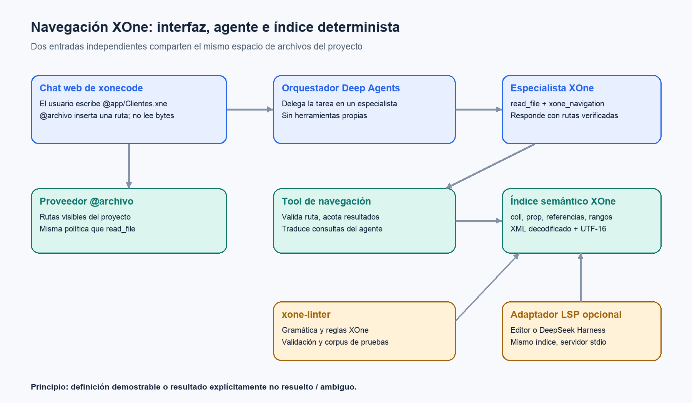

# Navegación semántica XOne y referencias de archivos en xonecode

**Diseño para desarrollo · 17 de septiembre de 2026**  
**Base examinada:** `deepseek-harness`, `xonecode` y `xone-linter` locales. **Destino de producto:** chat web; la CLI/TUI se retirará. Es una propuesta; no se ha implementado ni probado en xonecode.



## Decisión

Construir primero un **índice semántico XOne** compartible, integrado en `xone-linter`, y exponerlo a los especialistas de xonecode mediante una tool de LangChain de solo lectura (`xone_navigation`). Publicar después un servidor LSP sobre ese mismo índice **si** interesa dar soporte a editores o consumirlo desde DeepSeek Harness. No hace falta un modelo de IA dentro del LSP: el agente actual decide cuándo consultar la tool; el motor resuelve nombres y posiciones de forma determinista.

`@deepseek-ai/dsh-tool-lsp` no interpreta XOne. Es la cara visible para el modelo de cuatro consultas (`goToDefinition`, `findReferences`, `goToImplementation`, `hover`); necesita `dsh-lsp` y un proveedor como `dsh-lsp-stdio`, que a su vez necesita **un servidor de lenguaje real**. Añadir `.xne` a la configuración no crea la semántica de XOne. [Fuente DSH](/Users/projects/harnees/deepseek-harness/packages/lsp/tool-lsp/README.md), [proveedor stdio](/Users/projects/harnees/deepseek-harness/packages/lsp/lsp-stdio/README.md).

`@deepseek-ai/dsh-file-reference` resuelve otro problema: completar `@ruta` en el **chat web**. El proveedor `dsh-file-reference-local` descubre y ordena rutas. Al elegir una, la UI inserta texto; no lee, adjunta ni analiza el contenido. [Servicio](/Users/projects/harnees/deepseek-harness/packages/context/file-reference/README.md), [proveedor local](/Users/projects/harnees/deepseek-harness/packages/context/file-reference-local/README.md).

## Estado verificable de los tres proyectos

| Pieza | Existe | Límite relevante |
|---|---|---|
| `xonecode` | Deep Agents con filesystem confinado, especialistas y tool `regex_search`; la web tiene el chat de producto. | La búsqueda regex no resuelve referencias ni definiciones. El compositor web usa un `textarea` sin completado `@archivo`. La CLI/TUI actual no es una superficie objetivo porque se retirará. [Grafo](/Users/projects/xonecode/src/agent/grafo/xoneAgent.ts), [compositor](/Users/projects/xonecode/apps/web/src/componentes/Compositor.tsx). |
| `xone-linter` | Parser XML, modelo de proyecto, reglas de referencias XOne, decodificación UTF-8 e ISO-8859-1/15. | `SourceLocation` admite línea y columna, pero `XoneProject` suele guardar solo el archivo. El parser normalizado no conserva el rango de cada atributo. Las referencias JS de `CrossReferenceRule` se buscan con regex sobre scripts unidos: sirven para avisos, no para saltos exactos. [Modelo](/Users/projects/xone-linter/src/model/XoneModel.ts), [carga](/Users/projects/xone-linter/src/project/XoneProject.ts), [regla](/Users/projects/xone-linter/src/validator/rules/CrossReferenceRule.ts). |
| DeepSeek LSP | Contrato y tool de navegación, host stdio configurable. | No incluye servidor XOne. El host stdio exige archivos UTF-8 y abre temporalmente el documento consultado; el soporte de XOne con otras codificaciones requerirá decidir dónde se decodifica y cómo se entregan los resultados. [Proveedor](/Users/projects/harnees/deepseek-harness/packages/lsp/lsp-stdio/README.md). |

## Flujo desde el chat

1. El usuario escribe `Revisa @app/Clientes.xne` en el chat web. Un proveedor de rutas alineado con el **mismo espacio virtual** que `read_file` ofrece candidatos dentro del compositor.
2. La selección inserta la ruta en el mensaje. No introduce los bytes del fichero en el prompt.
3. El orquestador delega en un especialista. El especialista recibe las tools de lectura y `xone_navigation`; el orquestador sigue sin herramientas propias.
4. Para entender una relación, el especialista llama, por ejemplo, a `xone_navigation({operation:'definition', file_path:'/app/Pedidos.xne', line:18, character:30})` o consulta por símbolo XOne. La tool usa el backend confinado, resuelve el índice y devuelve `ruta:línea:columna` con el tipo de símbolo y la ambigüedad si existe.
5. El especialista abre con `read_file` los fragmentos que necesite y responde citando la fuente. Una escritura posterior sigue el flujo de permisos y aprobación existente.

`@archivo` es **entrada del usuario**; `xone_navigation` es **lectura semántica del agente**. Pueden activarse por separado.

## Núcleo semántico propuesto

Contrato interno, sin dependencia de Deep Agents, Cordis ni JSON-RPC:

```ts
type XoneSymbolKind = "coll" | "prop" | "event" | "macro" | "node" | "contents" | "script";
type XonePosition = { line: number; character: number }; // base 0, UTF-16
type XoneRange = { start: XonePosition; end: XonePosition };
type XoneLocation = { uri: string; range: XoneRange };
type XoneSymbolId = { kind: XoneSymbolKind; scope?: string; name: string };

interface XoneNavigationIndex {
  definition(at: XoneLocation): Promise<XoneLocation[]>;
  references(at: XoneLocation, includeDeclaration: boolean): Promise<XoneLocation[]>;
  hover(at: XoneLocation): Promise<{ text: string; source: string } | null>;
  symbols(query: string, limit: number): Promise<Array<{ id: XoneSymbolId; location: XoneLocation }>>;
}
```

El índice debe guardar el **rango del valor** de cada atributo, no solo el nodo. Ejemplo: sobre el valor de `mapcol="Clientes"` salta a la declaración `<coll name="Clientes">`; sobre `mapfld="Nombre"`, al `prop Nombre` dentro de esa colección. `contents src`, `inherits` y las referencias desde `app.xml` pueden añadirse como relaciones verificadas por las reglas existentes. Declaraciones duplicadas devuelven todas las ubicaciones y un aviso de ambigüedad. Valores JS calculados no se consideran referencias fiables. La implementación debe distinguir entre “sin definición”, “archivo aún no indexado” y “sintaxis no soportada”.

Para conservar posiciones: tokenizar XML con rangos sobre el texto **decodificado** y mantener un mapa de comienzos de línea; las columnas LSP se expresan en unidades UTF-16. `fast-xml-parser` puede seguir alimentando el modelo de validación, pero su árbol normalizado no basta para ubicar atributos exactos. El reconocimiento de scripts ES5 debe conservar archivo y rangos por coincidencia y excluir comentarios y cadenas irrelevantes; una regex sobre todos los JS concatenados no es base suficiente para `definition`/`references` confiables. [Posiciones LSP](https://microsoft.github.io/language-server-protocol/specifications/lsp/3.17/specification/).

### Alcance inicial sugerido

- **MVP:** declaraciones `coll` y `prop`; enlaces `mapcol`, `mapfld`, `linkedfield`, `contents src`, `inherits`; `definition`, `references` y `hover` con nombre, tipo y archivo de origen. `hover` solo usa hechos del proyecto y documentación XOne revisada.
- **Segunda iteración:** `app.xml`, eventos/nodos/macros, referencias literales en JavaScript y rutas de `include`/`style` cuando la gramática real esté documentada y cubierta por fixtures.
- **Después:** `goToImplementation` si se identifica una relación XOne con semántica de implementación; no devolverla como alias de `definition`. Diagnósticos y rename requieren contratos y pruebas adicionales.

## Integración en xonecode

- Introducir el índice como capacidad de lectura en `src/agent/`, con una interfaz inyectable y doble offline; no importar Deep Agents ni LSP en `src/core/`.
- Añadir `crearNavegacionXone(backend, indice)` junto a `crearBusquedaRegex(backend)` en `src/agent/grafo/xoneAgent.ts`, solamente a los especialistas que la necesitan. Mantener `grep`, `regex_search` y `read_file`: cada una responde una pregunta distinta.
- Validar las rutas de entrada y **también** las rutas devueltas con la misma política que las otras tools propias: raíz del proyecto, `puedeLeerRuta`, vistas `.xml` aplanadas y límite de tamaño. Las tools propias no heredan automáticamente los permisos del `FilesystemMiddleware`.
- Construir el índice con lecturas del mismo proyecto/namespace que ve el agente; no aceptar rutas físicas arbitrarias del modelo. Invalidar tras escrituras aprobadas o al comienzo de un turno si cambiaron archivos. Los resultados de una consulta deben corresponder a una misma versión del índice.
- Añadir al `Compositor.tsx` un proveedor de candidatos de ruta mediante el servidor de `src/web/servidor/`; buscar rutas del proyecto del turno actual, excluyendo `.env`, `.git`, `.xonecode`, `node_modules` y vistas generadas. Extraer una función compartida de enumeración de rutas si el código actual la facilita, pero no acoplar la función web a la CLI/TUI destinada a desaparecer. El catálogo debe coincidir con lo que `read_file` puede abrir. No precargar contenidos en el mensaje.

La tool podría exponer posiciones (`file_path`, `line`, `character`) y una consulta por nombre (`symbol`, `kind`, `scope`) para que un agente que aún no conoce la línea encuentre candidatos sin gastar varias llamadas de búsqueda. Las coordenadas en la entrada pública serían base 1; el índice mantendría base 0 UTF-16 internamente. Limitar y paginar resultados para no inundar el contexto.

## Cuándo añadir un servidor LSP

Si se quiere navegación también en editores o en DeepSeek Harness, empaquetar el núcleo como `xone-language-server` por stdio. Implementar `initialize`, `textDocument/didOpen`, `didChange`, `didClose`, `definition`, `references`, `hover` y `workspace/symbol`, con buffers abiertos que prevalecen sobre disco. En DSH se configuraría `dsh-lsp-stdio` para `.xne` (y `app.xml` mediante asignación explícita compatible con su enrutamiento por extensión), más `dsh-tool-lsp`. Antes de prometer soporte `.xne` no UTF-8 hay que resolver la restricción UTF-8 del host stdio de DSH; el servidor propio sí puede decodificar ficheros desde disco. No asignar todo `.xml` a XOne sin discriminar `app.xml` y los XML generados.

Esta fase añade proceso, protocolo, sincronización y empaquetado. Su ventaja es una sola semántica para xonecode, editores y DSH. **No usar Cordis como requisito del índice**: Cordis puede ser un adaptador futuro, igual que Deep Agents y LSP.

## Prueba de aceptación para el desarrollador

1. Fixture con dos `.xne`: `Pedidos` referencia `Clientes` mediante `mapcol`, y `mapfld` apunta a `Clientes.Nombre`. Desde el valor de cada atributo, `definition` devuelve la declaración exacta y `references` devuelve declaración y usos.
2. Cambiar `Clientes.Nombre` durante una sesión: la siguiente consulta devuelve posiciones de la versión nueva y nunca mezcla resultados anteriores.
3. Un `mapcol` duplicado produce ubicaciones múltiples con aviso; uno inexistente devuelve no encontrado. Un nombre calculado en JS se marca como no resuelto.
4. Un archivo ISO-8859-15 y un carácter fuera del plano básico prueban decodificación y columnas UTF-16. Un proyecto con `.xml` generado confirma que el índice favorece `.xne`.
5. `@` en el chat web ofrece únicamente rutas legibles del proyecto y al enviar el mensaje no inyecta contenido. Ninguna consulta ni sugerencia revela `.env`, `.git` o `.xonecode`.

## Decisión sobre el «modelo»

El **modelo de IA** puede ser el que ya usa Deep Agents; no tiene que aprender internamente la plataforma para dar un salto fiable. Le hacen falta instrucciones XOne y tools con resultados verificables. El **modelo semántico** del índice es el que hay que desarrollar: símbolos XOne, ámbito, definiciones, referencias y rangos. Usar un LLM para adivinar `definition` empeoraría precisamente la propiedad que se busca en una plataforma propietaria: certeza sobre el código real.
